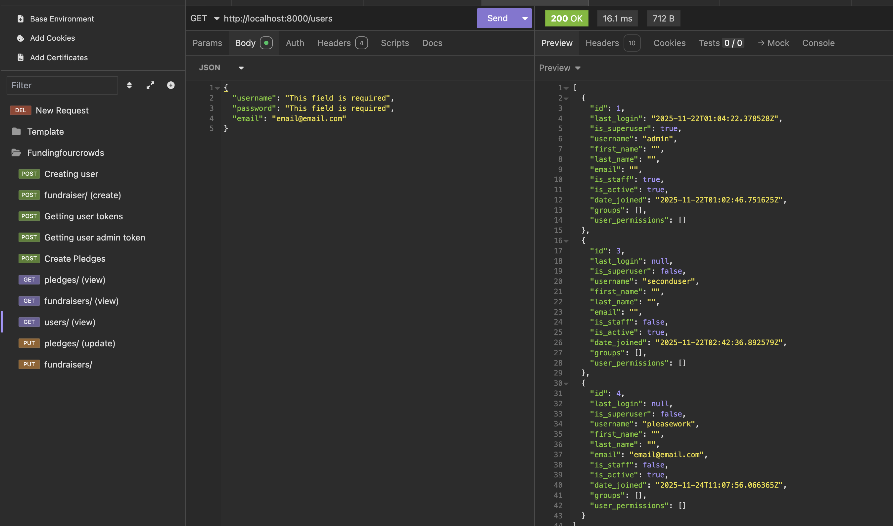
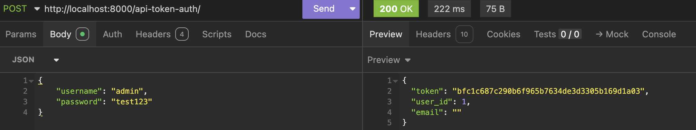
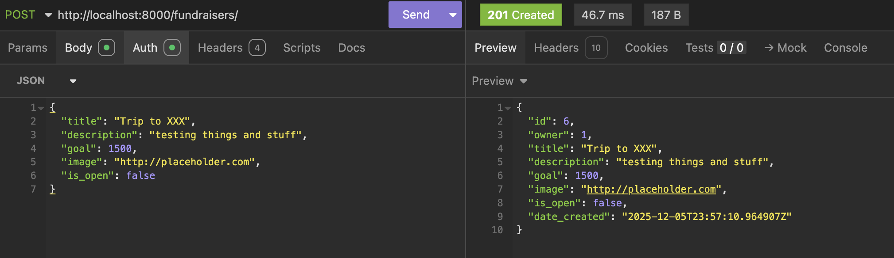
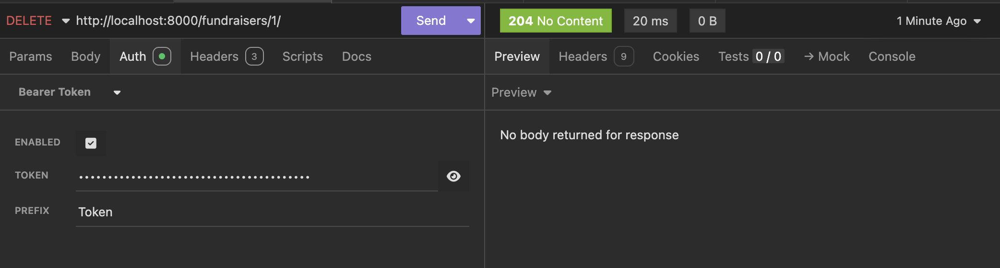

# FundingFourCrowds Back End

---
FundingFourCrowds - A Repo that contains my She Codes Crowdfunding back end project

## 1. Deployed Project

🔗 **Live API:**  
ADD HEROKU HERE 

## Table of Contents
- [FundingFourCrowds Back End](#fundingfourcrowds-back-end)
  - 
  - [1. Deployed Project](#1-deployed-project)
  - [Table of Contents](#table-of-contents)
    - [Concept \& Purpose](#concept--purpose)
    - [Intended Audience](#intended-audience)
    - [Features](#features)
  - [Front End Pages/Functionality](#front-end-pagesfunctionality)
    - [Project Status](#project-status)
    - [User Stories](#user-stories)
    - [Tech Stack](#tech-stack)
  - [API Overview](#api-overview)
    - [API Spec](#api-spec)
    - [Database Schema](#database-schema)
    - [Insomnia API Testing](#insomnia-api-testing)
  - [Successful GET Request](#successful-get-request)
  - 
  - [Successful POST Request](#successful-post-request)
  - 
  - 
  - [Successful DEL Request](#successful-del-request)
  - 
    - [Setup \& Installation](#setup--installation)
    - [Running Locally](#running-locally)
    - [Future Plans / Roadmap](#future-plans--roadmap)

### Concept & Purpose
They say 3's a crowd, but what if you were wanting to expand to four? FundingFourCrowds is a lightweight crowdfunding platform designed to help individuals seek support for meaningful personal experiences in a smaller 'crowd' or to be able to post if they are needing that +1 for a great deal! The platform enables users to share ideas such as attending events, learning new skills, travelling, wellness activities, or small life goals, and allows supporters to be apart of it!

The intent would be to not have a monetised option, and be able to pledge commitment to time or any human-centred way.

The focus is on connection, storytelling, and shared belief, rather than monetary value. 

### Intended Audience
- Individuals seeking support for personal growth experiences (e.g. courses, travel, events, wellness goals)
- Supporters who want to contribute to people they know or causes they resonate with
- Communities built around encouragement, shared values, and small meaningful goals

### Features

## Front End Pages/Functionality
- Home / Landing Page
    - Overview of the platform and its purpose
    - List of featured or recent fundraisers
    - Ability to navigate to sign up or log in
    - *Basic search or filter for fundraisers (Not yet implemented)
  
- User Registration / Login Page
  - Create a new user account (username, email, password)
  - Log in to an existing account
  - Authentication and session handling

### Project Status

### User Stories
- As a user, I want to create a fundraiser explaining my idea and funding goal
- As a supporter, I want to browse fundraisers and contribute
- As a fundraiser owner, I want to close or pause my fundraiser when my goal is met
- As a user, I want to view my pledges and fundraisers in one place

### Tech Stack
**Backend**
- Python 3.11+
- Django (web framework)
- Django REST Framework (API)
- Token authentication (likely DRF's built-in)

**Database**
- PostgreSQL (recommended) / SQLite (dev)

**Other**
- Insomnia for API testing
  
## API Overview
All endpoints are relative to the server root (e.g. `http://localhost:8000/`). Request and response bodies are JSON. Use header `Content-Type: application/json` for POST/PUT.

### API Spec

| URL | HTTP Method | Purpose | Request Body | Success Response Code | Authentication/Authorisation |
| --- | ----------- | ------- | ------------ | --------------------- | ---------------------------- |
|users/  |**POST**  | create user | {"username": “str”, "password": “str”, "email": “str”}  | 201 Created    |Anyone                |
|fundraisers/  |  **POST** | create new fundraiser  |  {"title": “str”,"description": “str”,"goal": int,"image": “str”,"is_open": false}  | 201 Created  | Any authenticated user |
| api-token-auth/ | **POST** | get user auth token  | {"username": "str", "password": "str"} |200 OK | Authorised only |
|pledges/  | **POST**  | create pledge to active fundraiser  | {"amount": int, "comment": "str”, "anonymous": bool, "fundraiser": int} | 201 Created |  Any authenticated, logged in user  | 
| users/    |  **GET**  | view users | no body required   | 200 OK  |  authorised admin only  |
|  pledges/   |  **GET**  |  view pledges   |  no body required    |   200 OK  |   Authenticated and authorised users only - Owner of fundraiser  |                           |
fundraisers/ | **GET** | view fundraisers | no body required | 200 OK | Anyone | |  pledges/   |  **GET**  |  view pledges   |  no body required    |   200 OK  |   Authenticated and authorised users only - Owner of fundraiser  |                           |
fundraisers/ | **PUT** | update fundraisers | {"title": "str","description": "str","goal": int,"image": "str","is_open": bool} | 200 OK | Authenticated and authorised user only (Creator of fundraiser) |

### Database Schema
![] still working on my IO dwaing skills 
+------------------+
|   CustomUser     |
+------------------+
| id (PK)          |
| username (unique)|
| email (unique)   |
| password         |
| date_joined      |
| is_active        |
+------------------+
        | 1
        |
        | owns
        |
        | *
+------------------+
|   Fundraiser     |
+------------------+
| id (PK)          |
| title            |
| description      |
| goal             |
| image            |
| is_open          |
| date_created     |
| owner_id (FK)    |
+------------------+
        | 1
        |
        | has many
        |
        | *
+------------------+
|     Pledge       |
+------------------+
| id (PK)          |
| amount           |
| comment          |
| anonymous        |
| created_at       |
| supporter_id(FK) |
| fundraiser_id(FK)|
+------------------+

### Insomnia API Testing
The following screenshots demonstrate successful aPI interactions using insomnia

## Successful GET Request

---
## Successful POST Request

---

---
## Successful DEL Request

---
## Project Status

- Backend API: ~70% complete (users, fundraisers, pledges, basic auth)
- Frontend: Basic pages planned / in progress
- Authentication: Token-based (DRF token)
- Search & filtering: Not yet implemented
- Non-monetary pledges: Core concept — implementation pending

## Setup & Installation

### Prerequisites
- Python 3.10+
- PostgreSQL (or SQLite for quick testing)
- pip & virtualenv

## Running Locally
**For step by step usage guide, [click here](/local_setup.md)**

## Roadmap / Future Plans

- Implement non-monetary pledge types (time commitment, messages, skills offer)
- Add frontend React/Vue/HTMX interface
- User dashboard with pledges + owned fundraisers
- Notifications / email integration
- Search, categories, tags for fundraisers
- Image upload validation & storage (local → S3 later)
- Soft delete / archiving for closed campaigns